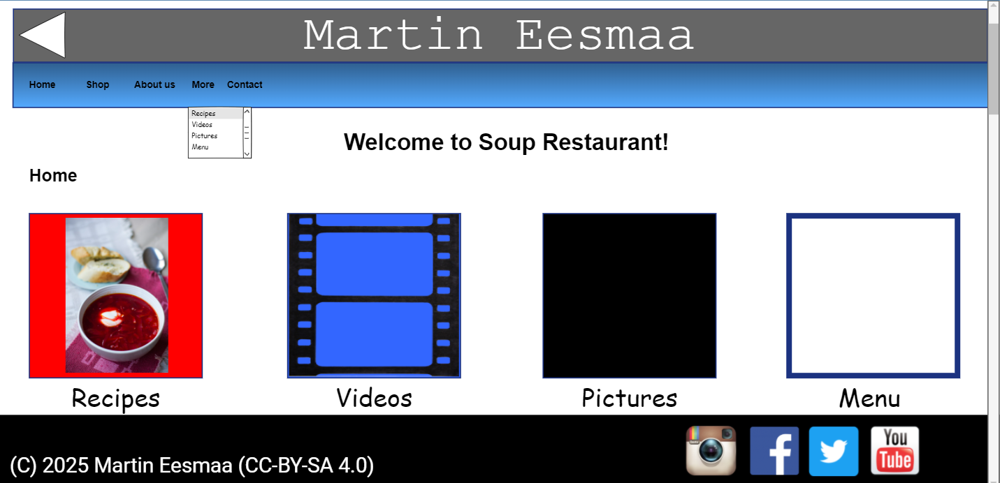
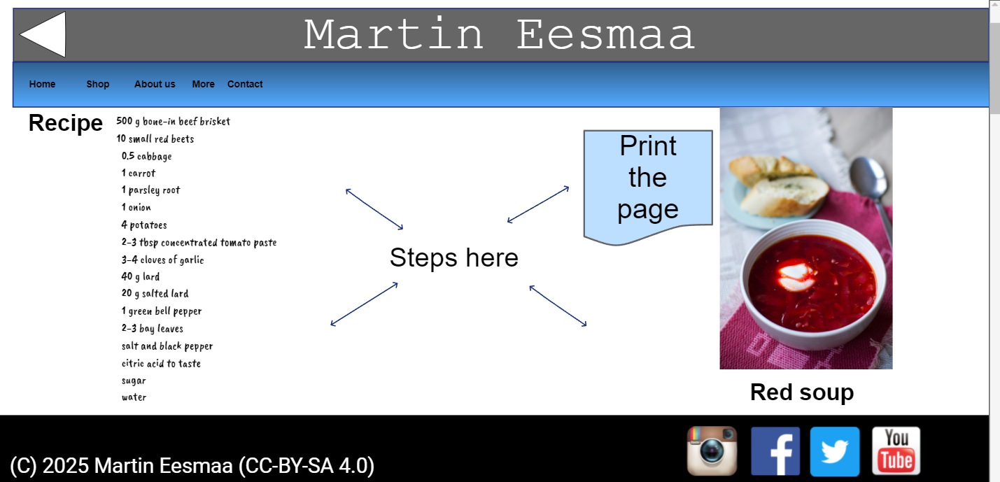
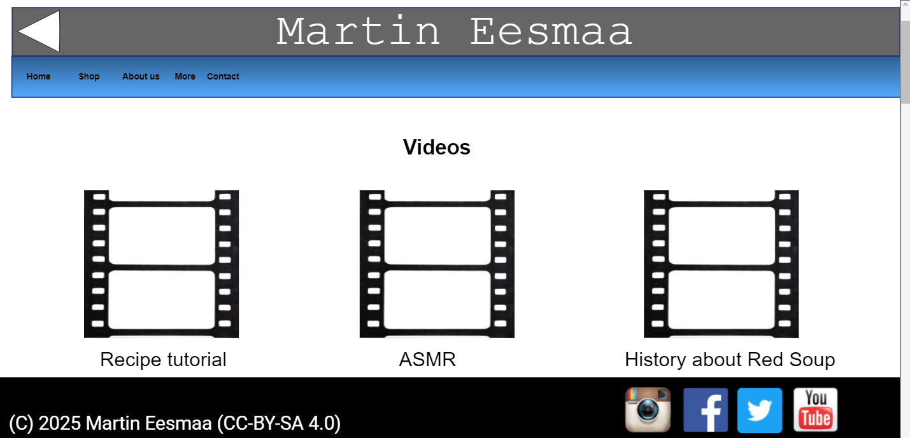

# Red Soup Restaurant (by Martin Eesmaa)

Red soup restaurant's website (School project)

I'm using [Evolus Pencil](https://pencil.evolus.vn/) to make website designs.

Feedbacks of my teacher are available [there](FEEDBACK.md).

### Development date status

Started development date at March 19th 2025.

Finished development date at June 9th 2025.

Result took 2 months and 3 weeks to make a website.

# Preview concepts of three pages

### Main page

### Recipe page

### Videos page

### Source designs

To see the source website designs, a source website design is available [there](design).